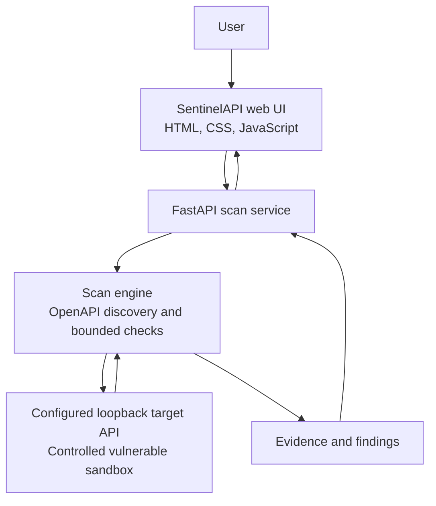

# SentinelAPI
## Secure your API before it reaches production.

SentinelAPI is a controlled, zero-trust API vulnerability scanner for authorized testing. It reads an OpenAPI or Swagger specification, discovers endpoints, runs a limited set of security checks against a configured local target, and returns evidence-backed findings with remediation guidance.

The current demo is designed to run on one machine against the included vulnerable FastAPI sandbox. It is an MVP, not a complete API security testing platform or a replacement for a security review.

## Problem

An API can return a valid response and still expose data that the authenticated user should not be allowed to access. A successful HTTP response alone does not prove that access was authorized.

Common issues include:

- **BOLA / IDOR:** one user can access another user's resource by changing an identifier.
- **Sensitive or excessive data exposure:** a response includes credentials, personal data, or internal fields the caller does not need.
- **Authentication misconfiguration:** a resource that appears protected responds to an unauthenticated request.
- **Rate-limit weakness:** repeated requests show no observed throttling signal.

Manual security testing can miss authorization and data-flow problems, especially when tests check only whether an endpoint responds. SentinelAPI checks only a limited set of patterns; it does not cover every API vulnerability.

## Solution

For the local demo, SentinelAPI follows this flow:

```text
Authorized API specification
          |
          v
Endpoint discovery
          |
          v
Controlled security testing
          |
          v
Evidence collection
          |
          v
Severity-ranked findings
          |
          v
Remediation guidance
```

The scanner accepts only configured loopback IP origins. The included target is a deliberately vulnerable, controlled sandbox. Do not point the scanner at a system unless you own it or have explicit authorization to test it.

## Key Features

- Ingest OpenAPI 3.x and Swagger 2.0 specifications in JSON or YAML.
- Discover API operations from the specification, up to 250 operations per scan.
- Test at most the first 50 discovered operations; active endpoint checks are limited to `GET` and `HEAD`.
- Check recognized `/users/{id}` resource paths for BOLA / IDOR by comparing the selected sandbox identity's own and cross-user responses. A finding requires both successful responses to identify the corresponding requested subjects and to differ; a `200` response by itself is not enough.
- Look for non-empty sensitive fields in JSON responses, including passwords, password hashes, tokens, API keys, secrets, SSNs, private keys, credentials, and internal fields. Values under recognized sensitive JSON keys are redacted from evidence excerpts; the non-JSON fallback only redacts bearer-token patterns.
- Probe likely protected `GET` and `HEAD` resources without credentials for a non-empty successful response.
- Make four controlled requests to a rate-limit candidate and report a weakness only when all succeed and no recognized throttling header or `429` response is observed. This result is explicitly heuristic.
- Return finding severity, confidence, endpoint, description, evidence, a redacted request example, and remediation guidance.
- Show scan stages and results in the web UI; provide authenticated scan history while the backend process is running.
- Restrict targets to configured loopback IP origins and do not follow redirects during target requests.
- Support local sign-up, sign-in, sign-out, and session-protected scan access.

## Architecture



The sandbox is an intentionally vulnerable local demo API. User accounts and sessions are stored separately in a local SQLite database; scan results are held in backend memory. Passwords must be at least 12 characters and are stored as salted PBKDF2-HMAC-SHA256 hashes. Sign-in issues an HttpOnly session cookie that expires after eight hours.

## Technology Stack

- **Frontend:** HTML, CSS, and JavaScript; GSAP for page motion. GSAP and the Manrope / DM Mono fonts are loaded from external CDNs.
- **Backend:** Python, FastAPI, and Uvicorn.
- **HTTP and specification parsing:** HTTPX and PyYAML. JSON parsing uses Python's standard library.
- **Sandbox:** a separate FastAPI application with controlled vulnerable endpoints.
- **Authentication storage:** SQLite, using Python's standard library.

## Security Scope

SentinelAPI is for authorized and controlled API security testing. In the current setup, the scanner backend accepts loopback IP targets that are configured through `SENTINELAPI_ALLOWED_ORIGINS`; the default is `http://127.0.0.1:8001`. It rejects non-loopback or unconfigured origins, avoids DNS resolution for target validation, bounds response sizes, and does not follow redirects.

The scanner must not be used against arbitrary third-party systems without authorization. Keep the backend and the deliberately vulnerable sandbox bound to loopback. The sandbox contains intentionally insecure demo responses and should never be exposed to a public network.

## Detected Security Checks

| Check | What the current MVP looks for |
|---|---|
| BOLA / IDOR | On recognized user-ID path templates, whether the chosen identity can retrieve a different user's resource and the returned response identifies that other subject. |
| Sensitive Data Exposure | Non-empty response fields matching known sensitive names, including passwords, tokens, keys, SSNs, and internal fields. Values are redacted in evidence. |
| Authentication Misconfiguration | A likely protected `GET` or `HEAD` candidate returning a non-empty 2xx response without authentication. OpenAPI security declarations and selected path patterns identify candidates; health, ready, live, and status paths are excluded. This is a heuristic check. |
| Rate-Limit Weakness | Four rapid `GET` requests with successful responses and no recognized `429`, `Retry-After`, or rate-limit header signal. Absence of a signal is not proof that no rate limit exists. |

These checks reflect the current MVP implementation and do not provide complete API vulnerability coverage.

## Local Setup

Python 3.10 or newer and Node.js are needed for the documented syntax checks. Run the web UI and each API in separate terminals.

### 1. Clone and install

```powershell
git clone https://github.com/THEPRASHANTCHAUDHARY/SentinelAPI.git
cd SentinelAPI
python -m pip install -r requirements.txt
```

### 2. Start the frontend

From the repository root, in a terminal:

```powershell
python -m http.server 5500 --bind 127.0.0.1
```

Frontend: <http://127.0.0.1:5500/main.html>

### 3. Start the scanner backend

In another terminal, from the repository root:

```powershell
python -m uvicorn backend.main:app --host 127.0.0.1 --port 8000
```

Backend: <http://127.0.0.1:8000>

Backend health: <http://127.0.0.1:8000/api/health>

### 4. Start the controlled vulnerable sandbox

In a third terminal, from the repository root:

```powershell
python -m uvicorn vulnerable_api.main:app --host 127.0.0.1 --port 8001
```

Sandbox: <http://127.0.0.1:8001>

Sandbox health: <http://127.0.0.1:8001/health>

Sandbox OpenAPI document: <http://127.0.0.1:8001/openapi.json>

### 5. Verify the services

From PowerShell, run:

```powershell
Invoke-RestMethod http://127.0.0.1:8000/api/health
Invoke-RestMethod http://127.0.0.1:8001/health
Invoke-RestMethod http://127.0.0.1:8001/openapi.json
```

The scanner backend's health route is `/api/health`; the sandbox health route is `/health`.

The frontend uses `http://127.0.0.1:8000` by default. If the backend runs at another address, update `assets/js/config.js`. The default authorized target origin is `http://127.0.0.1:8001`. To configure additional loopback IP origins in PowerShell before starting the backend, set `SENTINELAPI_ALLOWED_ORIGINS` to a comma-separated list, for example:

```powershell
$env:SENTINELAPI_ALLOWED_ORIGINS = "http://127.0.0.1:8001,http://127.0.0.1:8002"
```

Only loopback IP origins are accepted by target validation.

## Demo Flow

1. Open <http://127.0.0.1:5500/main.html>.
2. Create an account on **Sign Up**, then sign in. Scans require an authenticated session.
3. Open **Scan your API**.
4. Keep the default OpenAPI URL, `http://127.0.0.1:8001/openapi.json`, for the included demo.
5. Select a sandbox identity and the checks to run.
6. Click **Start Authorized Scan**.
7. Review discovered endpoints and scan progress.
8. Open a finding to inspect its evidence, request context, and remediation guidance.
9. Sign out to return to the public navigation state.

## Example Findings

The included sandbox serves an authenticated profile route at `/users/{user_id}/profile`. With the User A identity, the scanner checks User A's own resource and then changes the identifier while keeping the same credentials:

```text
GET /users/101/profile  (User A's resource)
GET /users/102/profile  (cross-user check using User A's credentials)
```

It reports BOLA only if both responses are successful, each response identifies the requested user, and the returned resources differ. A `200` response alone is not proof that User A was authorized to read User 102's data.

The demo sandbox deliberately returns separate user records with sensitive-looking fields for this controlled test. SentinelAPI redacts values under recognized sensitive JSON keys in evidence excerpts (and bearer-token patterns in its non-JSON fallback). It does not treat a `200` status alone as proof of BOLA.

The sandbox also contains an intentionally unprotected admin metrics route and a rate-limit route with no throttling behavior. These demonstrate the current authentication, exposure, and rate-limit checks. Use only the isolated local sandbox for this demo.

## API Endpoints

### Scanner backend

| Method | Route | Purpose |
|---|---|---|
| `GET` | `/api/health` | Public health and configured target origins. |
| `POST` | `/api/scans` | Start a scan; requires a signed-in user. |
| `GET` | `/api/scans` | List the signed-in user's in-memory scan history. |
| `GET` | `/api/scans/{scan_id}` | Read one of the signed-in user's scans. |
| `POST` | `/api/auth/signup` | Create a local account. |
| `POST` | `/api/auth/signin` | Sign in and issue an HttpOnly session cookie. |
| `POST` | `/api/auth/logout` | Invalidate the current session. |
| `GET` | `/api/auth/me` | Read the current authentication state. |
| `GET` | `/openapi.json` | FastAPI-generated scanner API schema. |

A scan request includes a configured `target`, a `spec_url` served by that target, a sandbox `identity` (`user-a` or `user-b`), and one or more selected `test_classes` (`bola`, `exposure`, `authentication`, `rate-limit`). Scan creation, listing, and result retrieval require a valid signed-in session.

The sandbox provides `GET /health`, `GET /openapi.json`, and the vulnerable demo routes used by the scan checks.

## Project Structure

```text
SentinelAPI/
|-- assets/
|   |-- js/
|   |   |-- api.js
|   |   |-- auth.js
|   |   |-- config.js
|   |   |-- overview.js
|   |   `-- scan-page.js
|   `-- styles/
|       `-- responsive.css
|-- backend/
|   |-- auth.py
|   `-- main.py
|-- vulnerable_api/
|   `-- main.py
|-- tests/
|   |-- test_auth_flow.py
|   `-- test_scan_flow.py
|-- main.html
|-- index.html
|-- scanner.html
|-- capabilities.html
|-- how-it-works.html
|-- scan-your-api.html
|-- see-security-workflow.html
|-- signin.html
|-- signup.html
|-- requirements.txt
|-- README.md
`-- .gitignore
```

`index.html` redirects to `main.html`. Local auth data is stored in `backend/sentinelapi_auth.sqlite3`, which is ignored by Git and is created when the auth database is initialized.

## Testing

Run the existing backend, authentication, and scanner tests from the repository root:

```powershell
python -m unittest discover -s tests -q
```

The scan-flow tests start the controlled sandbox on a temporary loopback port and cover a completed scan, supported findings, evidence redaction, target restrictions, OpenAPI parsing, and scan-page initial state. Authentication tests cover account creation, sign-in, session access, logout, expiry, and scan ownership.

Python syntax check:

```powershell
python -m compileall -q backend vulnerable_api
```

JavaScript syntax checks (PowerShell with Node.js installed):

```powershell
Get-ChildItem assets/js -Filter *.js | ForEach-Object {
    node --check $_.FullName
    if ($LASTEXITCODE -ne 0) { exit $LASTEXITCODE }
}
```

For a local HTTP smoke test, start all three services as described above, verify their health and OpenAPI URLs, then run an authenticated scan from the web UI against the included sandbox. The test suite's real-sandbox scan test also exercises the full scan path.

## Limitations

- The MVP checks a limited set of high-impact patterns; it is not complete API vulnerability coverage or a substitute for penetration testing.
- BOLA checks currently depend on recognized `/users/{id}`-style paths and responses that identify the requested subject. Other authorization patterns may not be detected.
- Endpoint discovery is capped at 250 operations, and active checks are limited to the first 50. Only `GET` and `HEAD` operations receive the general endpoint checks.
- Authentication misconfiguration and rate-limit results are heuristic and need human review. Business-logic issues often require application context that the scanner does not have.
- Scan history and results are held in memory and are lost when the scanner backend restarts. They are scoped to the authenticated user while the process is running.
- Local account records and sessions use an ignored SQLite file. Authentication does not include account recovery or login rate limiting and is not production identity management.
- The scanner is restricted to configured loopback IP origins and the included target is intentionally vulnerable. It is not a general-purpose remote scanner.

## Future Scope

These are possible improvements, not current features:

- JWT, OAuth, and API-key-aware authorization testing.
- Deeper multi-step business-logic testing and broader BOLA parameter inference.
- Agentic security test chains and AI-assisted documentation or reasoning.
- CI/CD integration, persistent scan history, and regression tracking.
- Expanded API security coverage.

## Team

- Nikhil Ranjan Choubey
- Prashant Chaudhary
- Mukesh Sah
- Mohammed Sahil

No individual contributions are assigned here.

## License

No `LICENSE` file is currently present in the repository. Licensing will be added separately.
